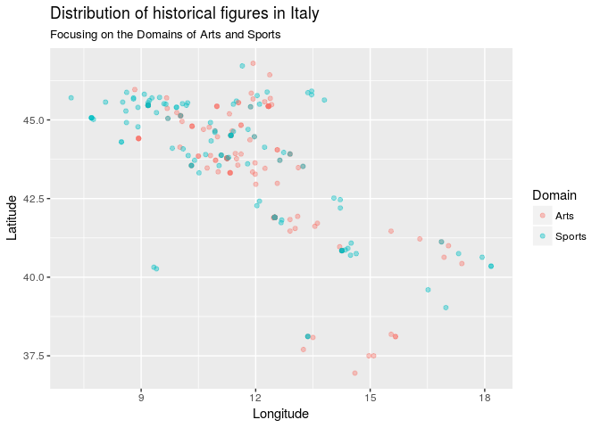

PROJECT TITLE
================
Duke Squirrels
04/19/2018

Your project goes here! Before you submit, make sure your chunks are turned off with `echo = FALSE`.

Load Packages
-------------

    ## Warning: running command 'timedatectl' had status 1

Load Data
---------

Introduction
------------

The data that we obtained contains information regarding historical figures. We downloaded the data from Kaggle, but the data was collected by the Massachusetts Institute of Technology about a year ago. The data is based off of metrics from many wikipedia pages and believe the variables in the dataframe can be used to extrapolate what makes a historical figure "popular" by Wikipedia standards. For our write-up, we chose to focus on the variables `full_name`, `birth_year`, `latitude`, `longitude`, `occupation`, `sex`, and `industry`. However, in our linear full model, we will select more than just these variables. By the end of our data analysis, we aim to derive the perfect combination of variables that lead to a high popularity index, which is recorded in the dataframe.

### Section 1- Introduction to the Data

    ## [1] 17

    ## [1] 10279

There are 17 variables and 10,279 observations (with all NAs removed in the new dataframe). Before removing the NAs, the full dataframe had 11,341 observations.

    ## # A tibble: 2 x 2
    ##   sex        n
    ##   <chr>  <int>
    ## 1 Female  1427
    ## 2 Male    8852

Based on the filtered dataframe, there are 1,427 women and 8,852 men that are considered historical figures.

##### Reference

<http://www.dummies.com/programming/r/how-to-remove-rows-with-missing-data-in-r/>

    ##          term  estimate
    ## 1 (Intercept) 20.802384
    ## 2     sexMale  1.553512

Here we estimated the historical popularity index using the `sex` variable. The slope fo the categorical variable `sexMale` is 1.55, suggesting that historical figures who are men have, on average, an increase in their overall popularity index of 1.55 as long as all other variables are held constant.

The linear model, based on the output, is:

`(historical_popularity_index) = 20.8(intercept) + 1.55(sexMale)`

    ## [1] 0.02538845

We found that the r-squared for the linear model `m_pop` is 2.54%, which suggests that 2.54% of the variability of the data can be explained by the linear model.

    ##                          term   estimate
    ## 1                 (Intercept) 17.3085615
    ## 2                     sexMale  1.5192217
    ## 3        domainBusiness & Law  0.3255091
    ## 4           domainExploration  0.5980194
    ## 5            domainHumanities  1.5000406
    ## 6          domainInstitutions  0.9254946
    ## 7         domainPublic Figure  1.0060640
    ## 8  domainScience & Technology  0.8719940
    ## 9                domainSports -4.3857126
    ## 10          article_languages  0.0711697
    ## 11              continentAsia  0.5457353
    ## 12            continentEurope  1.1232304
    ## 13     continentNorth America  0.0600264
    ## 14           continentOceania -0.5348510
    ## 15     continentSouth America  0.8157495

The linear model, based on the output, is:

`(historical_popularity_index) = 17.3(intercept) + 1.52(sexMale) + 0.3255091(domainBusiness & Law) + 0.5980194(domainExploration) + 1.5000406(domainHumanities) + 0.9254946(domainInstitutions) + 1.0060640(domainPublic Figure) + 0.8719940(domainScience & Technology) + -4.3857126(domainSports) + 0.0711697(article_languages)   + 0.5457353(continentAsia) + 1.1232304(continentEurope) + 0.0600264(continentNorth America  ) + -0.5348510(continentOceania) + 0.8157495(continentSouth America)`

Conclusion
----------

### Question 2

#### Create a map showing the concentration of popular historical figures around the world

