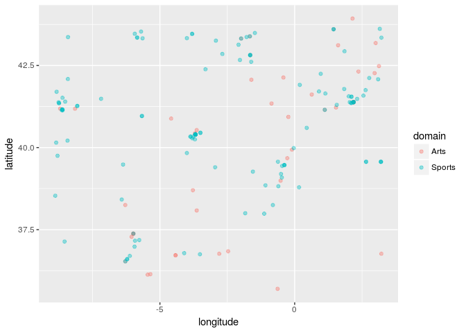

PROJECT TITLE
================
Duke Squirrels
04/19/2018

Your project goes here! Before you submit, make sure your chunks are turned off with `echo = FALSE`.

    ## Warning: running command 'timedatectl' had status 1

Introduction
------------

### Section 1- Introduction to the Data

### Question 1

#### Filter out NA values and record the number of observations and variables

#### Make a new dataset to avoid overriding the original dataframe

#### Record how many of the historical figures are men and how many are women

    ## [1] 17

    ## [1] 10279

There are 17 variables and 10,279 observations (with all NAs removed in the new dataframe). Before removing the NAs, the full dataframe had 11,341 observations.

    ## # A tibble: 8 x 2
    ##   domain                   n
    ##   <chr>                <int>
    ## 1 Arts                  2767
    ## 2 Business & Law         103
    ## 3 Exploration             88
    ## 4 Humanities            1227
    ## 5 Institutions          2753
    ## 6 Public Figure          319
    ## 7 Science & Technology  1315
    ## 8 Sports                1707

Based on the filtered dataframe, there are 1,427 women and 8,852 men that are considered historical figures.

##### Reference

<http://www.dummies.com/programming/r/how-to-remove-rows-with-missing-data-in-r/>

### Question 2

#### Create a map showing the concentration of popular historical figures around the world

### Question 3

### Section 2 - Mapping

### Question 4

### Question 5

### Question 6

### Section 3 - Linear Modeling

### Question 7

### Question 8

### Question 9

Conclusion
----------
