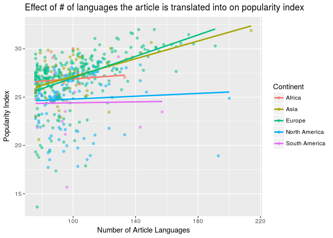

Wikipedia Popularity
================
Duke Squirrels
04/19/2018

Load Packages
-------------

    ## Warning: running command 'timedatectl' had status 1

Load Data
---------

Introduction
------------

The data that we obtained contains information regarding historical figures. We downloaded the data from Kaggle, but the data was collected by the Massachusetts Institute of Technology about a year ago. The data is based off of metrics from many wikipedia pages and believe the variables in the dataframe can be used to extrapolate what makes a historical figure "popular" by Wikipedia standards. For our write-up, we chose to focus on the variables `full_name`, `birth_year`, `latitude`, `longitude`, `occupation`, `sex`, and `industry`. However, in our linear full model, we will select more than just these variables. By the end of our data analysis, we aim to derive the perfect combination of variables that lead to a high popularity index, which is recorded in the dataframe.

It is important to note that the dataframe has been updated as recently as last year and the last historical figure's birth year recorded was 2005, suggesting that though the dataframe has not added a historical figure born after the year 2005, there is still currently data being collected on the ones already in the dataframe (ie page views, article languages, etc.).

### Section 1- Introduction to the Data

    ## [1] 17

    ## [1] 10279

There are 17 variables and 10,279 observations (with all NAs removed in the new dataframe). Before removing the NAs, the full dataframe had 11,341 observations.

##### Reference

<http://www.dummies.com/programming/r/how-to-remove-rows-with-missing-data-in-r/>

    ## # A tibble: 8 x 2
    ##   domain                   n
    ##   <chr>                <int>
    ## 1 Arts                  2767
    ## 2 Institutions          2753
    ## 3 Sports                1707
    ## 4 Science & Technology  1315
    ## 5 Humanities            1227
    ## 6 Public Figure          319
    ## 7 Business & Law         103
    ## 8 Exploration             88

    ## # A tibble: 6 x 2
    ##   continent         n
    ##   <chr>         <int>
    ## 1 Europe         6073
    ## 2 North America  2351
    ## 3 Asia           1021
    ## 4 Africa          362
    ## 5 South America   352
    ## 6 Oceania         120

Looking at simply the number of historical figures in each of the domain categories, it becomes easier to see which domain is the most popular. Specifically, the Arts dominate the `domain` variable, which is surprising because the `Institutions` domain incudes political, military, and religious figures which have dominated history. When looking at the number of historical figure by continent, Europe is the continent with the most historical figures across the ~5000 year timespan of the data with more historical figures than all other continents combined. This is not very surprising because many of the world's greatest thinkers and most influential figures came from all over Europe.

    ## # A tibble: 8 x 4
    ##   domain                mean median    sd
    ##   <chr>                <dbl>  <dbl> <dbl>
    ## 1 Arts                  21.8   22.4  3.06
    ## 2 Business & Law        22.3   22.6  2.36
    ## 3 Exploration           23.5   23.4  2.85
    ## 4 Humanities            24.3   24.3  2.21
    ## 5 Institutions          23.6   23.8  2.37
    ## 6 Public Figure         22.4   22.8  3.03
    ## 7 Science & Technology  23.4   23.2  1.83
    ## 8 Sports                17.7   17.3  2.86

To get a better understanding of our dataset, we created a faceted histogram that shows the distribution of the historical popularity index scores for the historical figures across all of the domains in the dataset and ran summary statistics on the dataframe as a whole. The visual lets us see the true distribution of historical figures across all of the domains, letting us know which areas are the most popular and have produced the most historical figures. The median popularity index score was 22.8723 and the mean was 22.14023.

### Section 2 - Men and Women

    ## # A tibble: 2 x 3
    ##   sex        n  prop
    ##   <chr>  <int> <dbl>
    ## 1 Female  1427 0.139
    ## 2 Male    8852 0.861

Based on the filtered dataframe, there are 1,427 women and 8,852 men that are considered historical figures of the total 10,279 historical figures. There are about 6.2 times as many historical men than women overall in the data. The timeframe of this data starts at -3500, or 3500 BCE, and ends at 2005, spanning about 5000 years. This means that a mere 13.9% of women in the entire timeframe are considered historical figures.

### Simple Linear Regression

    ##          term  estimate
    ## 1 (Intercept) 20.802384
    ## 2     sexMale  1.553512

Here we estimated the historical popularity index using the `sex` variable. The slope for the categorical variable `sexMale` is 1.55, suggesting that historical figures who are men have, on average, an increase in their overall popularity index of 1.55 as long as all other variables are held constant.

The linear model, based on the output, is:

`(historical_popularity_index) = 20.8(intercept) + 1.55(sexMale)`

    ## [1] 0.02538845

We found that the r-squared for the linear model `m_pop` is 2.54%, which suggests that 2.54% of the variability of the data can be explained by the linear model and that the model does not fit our data very well. In the next few steps, we will continue to re-evaluate our model to determine what combination of variables result in a high or low popularity index score.

    ## # A tibble: 2 x 3
    ##   sex        n  prop
    ##   <chr>  <int> <dbl>
    ## 1 Female  1053 0.196
    ## 2 Male    4309 0.804

For historical figures born after 1920, there are about 4 times as many male historical figures than female figures. This is intriguing because in this 85 year timeframe from 1920 - 2005, we have 1053 historical women out of a total of 1427 women in the entire timeframe.

    ##          term   estimate
    ## 1 (Intercept) 19.6057504
    ## 2     sexMale  0.5687071

In the previous model, we predicted the `historical_popularity_index` by `sex` across the entire ~5000 year time period of the data. The result was that historical figures who were men had, on average and with all other variables held constant, a popularity index score that was 1.55 points higher than that of women who were historical figures. However, in this model, we thought it would be interesting to analyze the 85 year timeframe after the year 1920, when women were given the right to vote in the U.S. and when, later in the century, women across the world where also granted greater rights. As a result, women made up about 20% of the historical figures as opposed to making up 13.9% of the historical figure population in the previous analysis.

The resulting linear model that only looked at the historical figures after 1920 is as follows:

`(historical_popularity_index) = 19.6(intercept) + 0.569(sexMale)`

The slope of the `sexMale` variable decreased significantly from the previous analysis. This shows that time is a factor that affects the historical popularity index of women specifically.

### Visual

Because there are so many historical figures from Europe, there is a lot of clustering near the 50-60 language marker. Additionally, Europe and Asia's slopes are very similar. This could be because Europe has 6,073 figures with pages translated into 50 or more languages and very high popularity index scores or that Asia has 1,021 popular historical figures, but those figures have pages that have been translated into much more than 50 languages. For example, there is a historical figure that is an outlier in the visual. Looking at the data, we identified this individual as Jesus Christ, whose Wikipedia page has been translated into 214 different languages.

    ## # A tibble: 1 x 4
    ##   full_name   historical_popularity_index article_languages country      
    ##   <chr>                             <dbl>             <int> <chr>        
    ## 1 Corbin Bleu                        18.9               193 United States

Interestingly, one of the historical figures has a low popularity index score, but his/her wikipedia page has been translated into almost 200 different languages. After filtering the data to locate the point that had a popularity index score less than 20 and an article that was translated into more than 175 languages, we derived that the outlier historical figure from North America is Corbin Bleu, the actor from High School Musical.

### Multiple Linear Regression

    ##                                        term    estimate
    ## 1                               (Intercept) 16.13336476
    ## 2                                   sexMale  1.51505537
    ## 3                      domainBusiness & Law  0.32594321
    ## 4                         domainExploration  0.56575963
    ## 5                          domainHumanities  1.49018106
    ## 6                        domainInstitutions  0.92757490
    ## 7                       domainPublic Figure  1.01544834
    ## 8                domainScience & Technology  0.86254971
    ## 9                              domainSports -4.37872010
    ## 10                        article_languages  0.10057213
    ## 11                            continentAsia  1.59712745
    ## 12                          continentEurope  2.22815622
    ## 13                   continentNorth America  1.46826358
    ## 14                         continentOceania  1.13423735
    ## 15                   continentSouth America  2.88294445
    ## 16          article_languages:continentAsia -0.02635754
    ## 17        article_languages:continentEurope -0.02759474
    ## 18 article_languages:continentNorth America -0.03508578
    ## 19       article_languages:continentOceania -0.04278132
    ## 20 article_languages:continentSouth America -0.05213559

Here we estimated the historical popularity index using the `sex`, `domain`, `article_languages`, and `continent` variables. We also included the interaction between continent and article languages. We would interpret the slope the same way we did with the simple linear regression above that had the `sex` variable only.

The linear model, based on the output, is:

`(historical_popularity_index) = 16.13336476    (intercept) + 1.51505537(sexMale) + 0.32594321  (domainBusiness & Law) + 0.56575963 (domainExploration) + 1.49018106    (domainHumanities) + 0.92757490 (domainInstitutions) + 1.01544834(domainPublic Figure) + 0.86254971(domainScience & Technology) +   -4.37872010(domainSports) + 0.10057213  (article_languages) +   1.59712745  (continentAsia) + 2.22815622    (continentEurope) + 1.46826358(continentNorth America   ) +     1.13423735(continentOceania) + 2.88294445   (continentSouth America) + -0.02635754(article_languages:continentAsia) + -0.02759474(article_languages:continentEurope) + -0.03508578(article_languages:continentNorth America) + -0.04278132(article_languages:continentOceania) + -0.05213559(article_languages:continentSouth America)`

    ## [1] 0.582584

### Backwards Selection with AIC

    ## Start:  AIC=16042.73
    ## historical_popularity_index ~ sex + domain + article_languages + 
    ##     continent + continent * article_languages
    ## 
    ##                               Df Sum of Sq   RSS   AIC
    ## <none>                                     48761 16043
    ## - article_languages:continent  5       170 48931 16068
    ## - sex                          1      2448 51210 16544
    ## - domain                       7     35938 84699 21704

    ##                                        term    estimate
    ## 1                               (Intercept) 16.13336476
    ## 2                                   sexMale  1.51505537
    ## 3                      domainBusiness & Law  0.32594321
    ## 4                         domainExploration  0.56575963
    ## 5                          domainHumanities  1.49018106
    ## 6                        domainInstitutions  0.92757490
    ## 7                       domainPublic Figure  1.01544834
    ## 8                domainScience & Technology  0.86254971
    ## 9                              domainSports -4.37872010
    ## 10                        article_languages  0.10057213
    ## 11                            continentAsia  1.59712745
    ## 12                          continentEurope  2.22815622
    ## 13                   continentNorth America  1.46826358
    ## 14                         continentOceania  1.13423735
    ## 15                   continentSouth America  2.88294445
    ## 16          article_languages:continentAsia -0.02635754
    ## 17        article_languages:continentEurope -0.02759474
    ## 18 article_languages:continentNorth America -0.03508578
    ## 19       article_languages:continentOceania -0.04278132
    ## 20 article_languages:continentSouth America -0.05213559

    ## [1] 45215.27

### The perfect historical popularity index

Conclusion
----------
