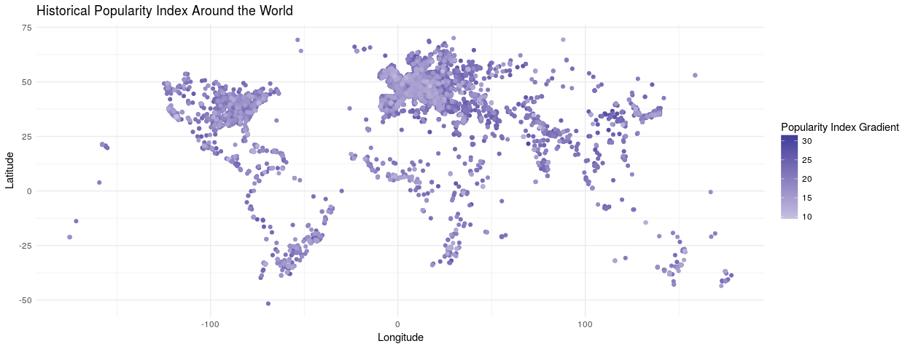

Wikipedia Popularity
================
Duke Squirrels
04/19/2018

Load Packages
-------------

Load Data
---------

Introduction
------------

The data that we obtained contains information regarding historical figures. We downloaded the data from Kaggle, but the data was collected by the Massachusetts Institute of Technology about a year ago. The data is based off of metrics from many wikipedia pages and believe the variables in the dataframe can be used to extrapolate what makes a historical figure "popular" by Wikipedia standards.

By the end of our data analysis, we aim to derive the perfect combination of variables that lead to a high popularity index, which is recorded in the dataframe.

### Section 1- Introduction to the Data

    ## [1] 17

    ## [1] 10279

    ## # A tibble: 10 x 4
    ##     rank full_name           birth_year historical_popularity_index
    ##    <int> <chr>                    <int>                       <dbl>
    ##  1     1 Aristotle                 -384                        32.0
    ##  2     2 Plato                     -427                        32.0
    ##  3     3 Jesus Christ                -4                        31.9
    ##  4     4 Socrates                  -469                        31.7
    ##  5     5 Alexander the Great       -356                        31.6
    ##  6     6 Leonardo da Vinci         1452                        31.5
    ##  7     7 Julius Caesar             -100                        31.1
    ##  8     8 Homer                     -800                        31.1
    ##  9     9 Pythagoras                -570                        31.1
    ## 10    10 Archimedes                -287                        31.0

There are 17 variables and 10,279 observations (with all NAs removed in the new dataframe). Before removing the NAs, the full dataframe had 11,341 observations.

In addition, we decided to add a `rank` variable to the dataframe to rank the historical figures based off of their `historical_popularity_index`.

For our analysis, we will look at the variables `domain`, `sex`, and `article_languages` and then make a full linear model.

### Section 2 - How the Variable `Domain` Affects `Historical_Popularity_Index`

    ## # A tibble: 8 x 2
    ##   domain                   n
    ##   <chr>                <int>
    ## 1 Arts                  2767
    ## 2 Institutions          2753
    ## 3 Sports                1707
    ## 4 Science & Technology  1315
    ## 5 Humanities            1227
    ## 6 Public Figure          319
    ## 7 Business & Law         103
    ## 8 Exploration             88

    ## # A tibble: 6 x 2
    ##   continent         n
    ##   <chr>         <int>
    ## 1 Europe         6073
    ## 2 North America  2351
    ## 3 Asia           1021
    ## 4 Africa          362
    ## 5 South America   352
    ## 6 Oceania         120

Looking at simply the number of historical figures in each of the domain categories, it becomes easier to see which domain has the most number of historical figures. When looking at the number of historical figures by continent, Europe is the continent with the most historical figures across the ~5000 year timespan of the data with more historical figures than all other continents combined.

### Simple Linear Regression

    ##                         term   estimate
    ## 1                (Intercept) 21.8387078
    ## 2       domainBusiness & Law  0.5023786
    ## 3          domainExploration  1.7101377
    ## 4           domainHumanities  2.4482581
    ## 5         domainInstitutions  1.7164494
    ## 6        domainPublic Figure  0.5322192
    ## 7 domainScience & Technology  1.5341595
    ## 8               domainSports -4.1121942

Here we estimated the historical popularity index using the `domain` variable using a simple linear regression. The slope for the level in `domain` named `Business & Law` is 0.502, suggesting that historical figures who belong in the `Business & Law` domain have, on average, an increase in their overall popularity index of 0.502 as long as all other variables are held constant.

In this model, the largest coefficient belongs to the domain of `Humanities`. With all else held constant, historical figures who belong to the domain of `Humanities` have a historical popularity index that is, on average, 2.448 higher than the intercept.

The least coefficient belongs to `Sports`. With all else held constant, historical figures who belong to `Sports`, have an index that is on average, 4.11 lower than the intercept.

The linear model, based on the output, is:

`(historical_popularity_index) = 21.839(intercept) + 0.502(domainBusiness & Law) + 1.710(domainExploration) + 2.448(domainHumanities) + 1.716(domainInstitutions) + 0.532(domainPublic Figure) + 1.534(Science & Technology) - 4.112(domainSports)`

    ## [1] 0.4011846

We found that the r-squared for the linear model `domain_m` is 40.1%, which suggests that 40.1% of the variability of the data can be explained by the domain of the historical figure.

### Section 3 - How the Variable `Sex` Affects `Historical_Popularity_Index`

    ## # A tibble: 2 x 3
    ##   sex        n  prop
    ##   <chr>  <int> <dbl>
    ## 1 Female  1427 0.139
    ## 2 Male    8852 0.861

Based on the filtered dataframe, there are 1,427 women and 8,852 men that are considered historical figures of the total 10,279 historical figures. There are about 6.2 times as many historical men than women overall in the data. The timeframe of this data starts at -3500, or 3500 BCE, and ends at 2005, spanning about 5000 years. This means that a mere 13.9% of women in the entire timeframe are considered historical figures.

### Simple Linear Regression

    ##          term  estimate
    ## 1 (Intercept) 20.802384
    ## 2     sexMale  1.553512

Here we estimated the historical popularity index using the `sex` variable using a simple linear regression. The slope for the categorical variable `sexMale` is 1.55, suggesting that historical figures who are men have, on average, an increase in their overall popularity index of 1.55 as long as all other variables are held constant.

The linear model, based on the output, is:

`(historical_popularity_index) = 20.8(intercept) + 1.55(sexMale)`

    ## [1] 0.02538845

We found that the r-squared for the linear model `m_pop` is 2.54%, which suggests that 2.54% of the variability of the data can be explained by sex and that the model does not fit our data very well. We think there might be a confounding variable, so we will look to see if `birth_year` is one.

### Simple Linear Regression - For All Figures Born After 1920

    ## # A tibble: 2 x 3
    ##   sex        n  prop
    ##   <chr>  <int> <dbl>
    ## 1 Female  1053 0.196
    ## 2 Male    4309 0.804

For historical figures born after 1920, there are about 4 times as many male historical figures than female figures. This is intriguing because in this 85 year timeframe from 1920 - 2005, we have 1053 historical women out of a total of 1427 women in the entire timeframe.

    ##          term   estimate
    ## 1 (Intercept) 19.6057504
    ## 2     sexMale  0.5687071

In the previous model, we predicted the `historical_popularity_index` by `sex` across the entire ~5000 year time period of the data. The result was that historical figures who were men had, on average and with all other variables held constant, a popularity index score that was 1.55 points higher than that of women who were historical figures. However, in this model, we thought it would be interesting to analyze the 85 year timeframe after the year 1920, when women were given the right to vote in the U.S. and when, later in the century, women across the world where also granted greater rights. As a result, women made up about 20% of the historical figures as opposed to making up 13.9% of the historical figure population in the previous analysis.

The resulting linear model that only looked at the historical figures after 1920 is as follows:

`(historical_popularity_index) = 19.6(intercept) + 0.569(sexMale)`

The slope of the `sexMale` variable decreased significantly from the previous analysis. This shows that time is a factor that affects the historical popularity index of women specifically.

    ## [1] 0.005101232

We found that the r-squared for the linear model `m_pop_sex2` is 0.51%, which suggests that 0.51% of the variability of the data can be explained by the linear model and that the model does not fit our data very well at all. The fact that the r-squared value went down makes sense because it is harder to differentiate between men and women, in terms of their historical popularity index score. But in larger picture, we see that sex as a predictor does not impact the variability to a large extent and there are other variables like domain which are more impactful.

### Section 4 - How the Variable `Article_Languages` Affects `Historical_Popularity_Index`

### Simple Linear Regression

    ##                term    estimate
    ## 1       (Intercept) 18.47995918
    ## 2 article_languages  0.08920223

Here we estimated the historical popularity index using the `article_langugaes` variable on a simple linear regression model. The slope for the variable `article_languages` is 0.089, suggesting that for every one increase in the amount of languages the article has been translated into, that historical figure, on average, will have an increase in their overall popularity index of 0.089 as long as all other variables are held constant.

The linear model, based on the output, is:

`(historical_popularity_index) = 21.839(intercept) + 0.089(article_languages)`

    ## [1] 0.2158346

We found that the r-squared for the linear model `artlang_m` is 21.6%, which suggests that 21.6% of the variability of the data can be explained by the linear model and that the model doesn't necessarily fit our data very well, but it fits it significantly better than the sex variable.

From this visual, for historical figures from Asia and Europe, we see that as the number of languages one's article increases, the popularity index also increases. However, for Africa and the Americas, there is little upward movement in popularity as article languages increases. The regression lines for these three continents tend to stay relatively constant.

    ## # A tibble: 3 x 5
    ##   full_name     historical_popular… article_languages country  occupation 
    ##   <chr>                       <dbl>             <int> <chr>    <chr>      
    ## 1 Jesus Christ                 31.9               214 Israel   Religious …
    ## 2 Muhammad                     30.6               150 Saudi A… Religious …
    ## 3 Qin Shi Huang                29.5               144 China    Politician

There is a historical figure that is an outlier considering Asia's spread in the visual. By filtering the data for the figure with a page translated into more than 200 languages, we identified this individual as Jesus Christ, whose Wikipedia page has been translated into 214 different languages. The next highest was Muhammed, whose article has 150 languages. Both were historical figures.

    ## # A tibble: 1 x 4
    ##   full_name   historical_popularity_index article_languages country      
    ##   <chr>                             <dbl>             <int> <chr>        
    ## 1 Corbin Bleu                        18.9               193 United States

Interestingly, one of the historical figures has a low popularity index score, an outlier, but his/her wikipedia page has been translated into almost 200 different languages. After filtering the data to locate the point that had a popularity index score less than 20 and an article that was translated into more than 175 languages, we derived that the outlier historical figure from North America is Corbin Bleu, the actor from High School Musical.

After looking at how the variables `domain`, `sex`, and `article_languages` each affect historical popularity index, we see that they do play a role. To summarize our results and check to see if other variables affect the historical popularity index all at once, we will use a multiple linear regression full model.

### Multiple Linear Regression

    ##                          term     estimate
    ## 1                 (Intercept) 20.793011611
    ## 2                     sexMale  1.430580174
    ## 3        domainBusiness & Law  0.334893828
    ## 4           domainExploration  0.290909608
    ## 5            domainHumanities  1.099204078
    ## 6          domainInstitutions  0.394141870
    ## 7         domainPublic Figure  0.753314854
    ## 8  domainScience & Technology  0.781376261
    ## 9                domainSports -4.204874910
    ## 10          article_languages  0.067488020
    ## 11              continentAsia  0.289772051
    ## 12            continentEurope  1.223777083
    ## 13     continentNorth America  0.411299202
    ## 14           continentOceania -0.203625981
    ## 15     continentSouth America  1.154744369
    ## 16                 birth_year -0.001821584

Here we estimated the historical popularity index using the `sex`, `domain`, `birth_year`, `article_languages`, and `continent` variables. We also included the interaction between continent and article languages. We would interpret the slope the same way we did with the simple linear regression above that had the `sex` variable only.

The linear model, based on the output, is:

`(historical_popularity_index) = 19.9(intercept) + 1.43(sexMale) + 0.335(domainBusiness & Law) + 0.275  (domainExploration) + 1.097(domainHumanities) + 0.398(domainInstitutions) + 0.763(domainPublic Figure) + 0.778(domainScience & Technology) - 4.20(domainSports) + 0.0893(article_languages) + 1.235 (continentAsia) + 2.063(continentEurope) + 1.322(continentNorth America ) + 0.980(continentOceania) + 2.68(continentSouth America) - 0.0235(article_languages:continentAsia) - 0.0209(article_languages:continentEurope) - 0.0227(article_languages:continentNorth America) - 0.0303(article_languages:continentOceania) - 0.0384(article_languages:continentSouth America) - 0.001813092(birth_year)`

    ## [1] 0.6340561

    ## [1] 0.6335213

The r-squared value for the full model is 63.5%, which means that more than half of the variability of the data can be explained by the model. This is a significant increase from the sex regression model we did comparing `sex` and `historical_popularity_index` scores, which resulted in an r-squared of 2.54%. The adjusted r-squared is 63.4%. This is also a large increase from the domain model, which had an r-squared of 40%. Thus the full model has the most predictive power.

### Backwards Selection with AIC

    ## Start:  AIC=14681.98
    ## historical_popularity_index ~ sex + domain + article_languages + 
    ##     continent + birth_year
    ## 
    ##                     Df Sum of Sq   RSS   AIC
    ## <none>                           42749 14682
    ## - continent          5    1963.5 44712 15134
    ## - sex                1    2181.9 44931 15192
    ## - birth_year         1    6182.5 48931 16068
    ## - article_languages  1   13893.0 56642 17573
    ## - domain             7   28195.2 70944 19875

    ##                          term     estimate
    ## 1                 (Intercept) 20.793011611
    ## 2                     sexMale  1.430580174
    ## 3        domainBusiness & Law  0.334893828
    ## 4           domainExploration  0.290909608
    ## 5            domainHumanities  1.099204078
    ## 6          domainInstitutions  0.394141870
    ## 7         domainPublic Figure  0.753314854
    ## 8  domainScience & Technology  0.781376261
    ## 9                domainSports -4.204874910
    ## 10          article_languages  0.067488020
    ## 11              continentAsia  0.289772051
    ## 12            continentEurope  1.223777083
    ## 13     continentNorth America  0.411299202
    ## 14           continentOceania -0.203625981
    ## 15     continentSouth America  1.154744369
    ## 16                 birth_year -0.001821584

    ## [1] 43854.52

    ## [1] 0.6340561

    ## [1] 0.6335213

After creating the selected model, we found that the full and selected models were identical, which indicates that the full model had the best predictive power.

### The perfect historical popularity index

Based on the full and selected models, to have the highest popularity index score, one should: be a man, study in the domain of the humanities, and live somewhere in the continent of South America. Additionally, the predicted popularity index score would increase if the figure was born before the year 0 (or before common era). This is because though the slope for `birth_year` is negative, the birth year itself for these figures is also negative (ie -3500), so the overall slope would be positive.

Conclusion
----------

### Distance

    ## # A tibble: 90,000 x 3
    ##    distance name.arts               name.sci                     
    ##       <dbl> <chr>                   <chr>                        
    ##  1       0. Wolfgang Amadeus Mozart Christian Doppler            
    ##  2       0. Johann Sebastian Bach   Ernst Karl Abbe              
    ##  3       0. Richard Wagner          Gottfried Wilhelm von Leibniz
    ##  4       0. Claude Monet            Antoine Lavoisier            
    ##  5       0. Claude Monet            Rudolf Diesel                
    ##  6       0. Claude Monet            Pierre Curie                 
    ##  7       0. Claude Monet            Antoine Henri Becquerel      
    ##  8       0. Claude Monet            Jacques Lacan                
    ##  9       0. Claude Monet            Vilfredo Pareto              
    ## 10       0. Claude Monet            Augustin Louis Cauchy        
    ## # ... with 89,990 more rows

    ## # A tibble: 739 x 3
    ## # Groups:   name.arts [300]
    ##    name.arts               closest name.sci                     
    ##    <chr>                     <dbl> <chr>                        
    ##  1 Wolfgang Amadeus Mozart     0.  Christian Doppler            
    ##  2 Michelangelo               15.3 Luca Pacioli                 
    ##  3 Johann Sebastian Bach       0.  Ernst Karl Abbe              
    ##  4 Ludwig van Beethoven       23.2 Hermann Emil Fischer         
    ##  5 Vincent van Gogh           46.0 Gerardus Mercator            
    ##  6 Pablo Picasso             114.  Pomponius Mela               
    ##  7 Raphael                    42.3 Luca Pacioli                 
    ##  8 Albrecht Dürer             15.6 Georg Ohm                    
    ##  9 Salvador Dalí              60.4 François Arago               
    ## 10 Richard Wagner              0.  Gottfried Wilhelm von Leibniz
    ## # ... with 729 more rows

    ## # A tibble: 90,000 x 3
    ##    distance name.arts             name.hum       
    ##       <dbl> <chr>                 <chr>          
    ##  1       0. Praxiteles            Plato          
    ##  2       0. Praxiteles            Socrates       
    ##  3       0. Sandro Botticelli     Dante Alighieri
    ##  4       0. Giotto di Bondone     Dante Alighieri
    ##  5       0. Donatello             Dante Alighieri
    ##  6       0. Filippo Brunelleschi  Dante Alighieri
    ##  7       0. Jean-Baptiste Lully   Dante Alighieri
    ##  8       0. Cimabue               Dante Alighieri
    ##  9       0. Andrea del Verrocchio Dante Alighieri
    ## 10       0. Paolo Uccello         Dante Alighieri
    ## # ... with 89,990 more rows

    ## # A tibble: 932 x 3
    ## # Groups:   name.arts [300]
    ##    name.arts            closest name.hum           
    ##    <chr>                  <dbl> <chr>              
    ##  1 Praxiteles               0.  Plato              
    ##  2 Praxiteles               0.  Socrates           
    ##  3 Thespis                 61.5 Pythagoras         
    ##  4 Ozzy Osbourne           36.4 William Shakespeare
    ##  5 Edward Elgar            38.4 William Shakespeare
    ##  6 Sandro Botticelli        0.  Dante Alighieri    
    ##  7 Giotto di Bondone        0.  Dante Alighieri    
    ##  8 Donatello                0.  Dante Alighieri    
    ##  9 Filippo Brunelleschi     0.  Dante Alighieri    
    ## 10 Fra Angelico            24.1 Dante Alighieri    
    ## # ... with 922 more rows

the historgram

    ## # A tibble: 8 x 4
    ##   domain                mean median    sd
    ##   <chr>                <dbl>  <dbl> <dbl>
    ## 1 Arts                  21.8   22.4  3.06
    ## 2 Business & Law        22.3   22.6  2.36
    ## 3 Exploration           23.5   23.4  2.85
    ## 4 Humanities            24.3   24.3  2.21
    ## 5 Institutions          23.6   23.8  2.37
    ## 6 Public Figure         22.4   22.8  3.03
    ## 7 Science & Technology  23.4   23.2  1.83
    ## 8 Sports                17.7   17.3  2.86

To get a better understanding of our dataset, we created a faceted histogram that shows the distribution of the historical popularity index scores for the historical figures across all of the domains in the dataset and ran summary statistics on the dataframe as a whole. The visual lets us see the true distribution of historical figures across all of the domains, letting us know which areas are the most popular and have produced the most historical figures. We think this visual is important because it gives us a glimpse of how historical popularity index varies across the domains. We will comtinue looking at other variables to see if they contribute into the historical popularity index score.

### Mapping

From this visual, we can see that the areas of the world that are generally uninhabitable or extremely rural do not have historical figures. For example, the center of South America, a large portion of North Africa, most of Russia, and a big portion of Australia. Additionally, in these countries and continents, the coast seems to have the most historical figures.

Conclusion
----------
