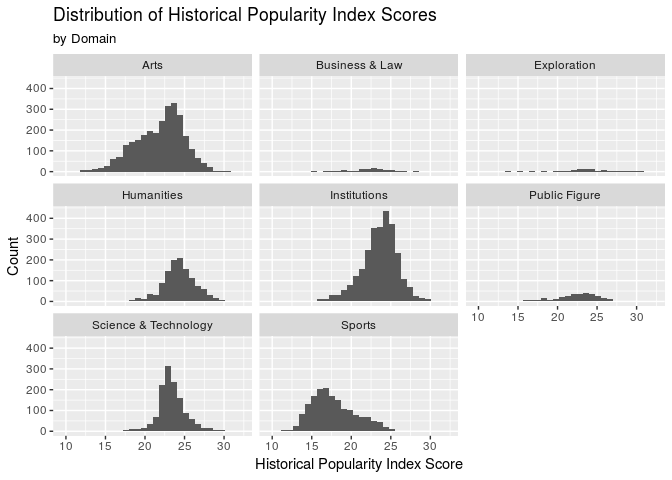

Wikipedia Popularity
================
Duke Squirrels
04/19/2018

Load Packages
-------------

Load Data
---------

Introduction
------------

The data that we obtained contains information about prominent historical figures who were born from as far back as 3500 BCE to those born in 2005. We downloaded the data from Kaggle, but the data was collected by the Massachusetts Institute of Technology about a year ago. The data is based off of metrics from many wikipedia pages and we believe the variables in the dataframe can be used to extrapolate what makes a historical figure "popular" on Wikipedia, the internet's leading encyclopedia.

By the end of our data analysis, we aim to derive the perfect combination of variables that lead to a high popularity index, which is recorded in the dataframe.

### Section 1- Introduction to the Data

    ## # A tibble: 10 x 5
    ##     rank full_name           occupation    birth_year historical_populari…
    ##    <int> <chr>               <chr>              <int>                <dbl>
    ##  1     1 Aristotle           Philosopher         -384                 32.0
    ##  2     2 Plato               Philosopher         -427                 32.0
    ##  3     3 Jesus Christ        Religious Fi…         -4                 31.9
    ##  4     4 Socrates            Philosopher         -469                 31.7
    ##  5     5 Alexander the Great Military Per…       -356                 31.6
    ##  6     6 Leonardo da Vinci   Inventor            1452                 31.5
    ##  7     7 Julius Caesar       Politician          -100                 31.1
    ##  8     8 Homer               Writer              -800                 31.1
    ##  9     9 Pythagoras          Philosopher         -570                 31.1
    ## 10    10 Archimedes          Mathematician       -287                 31.0

There are 18 variables and 10279 observations (with all NAs removed in the new dataframe). Before removing the NAs, the full dataframe had 11,341 observations.

In addition, we decided to add a `rank` variable to the dataframe to rank the historical figures based off of their `historical_popularity_index`.

We have also found the top 10 figures with the highest popularity index score in order. They are: Aristotle, Plato, Jesus Christ, Socrates, Alexander the Great, Leonardo da Vinci, Julius Caesar, Homer, Pythagoras, Archimedes

#### Introductory Exploratory Analysis

    ## # A tibble: 6 x 2
    ##   continent         n
    ##   <chr>         <int>
    ## 1 Europe         6073
    ## 2 North America  2351
    ## 3 Asia           1021
    ## 4 Africa          362
    ## 5 South America   352
    ## 6 Oceania         120

Europe has the most historical figures in the dataset with 6073, followed by North America with 2351, and then by Asia, which has 1021.

    ## # A tibble: 6 x 2
    ##   continent      median
    ##   <chr>           <dbl>
    ## 1 Africa         33138.
    ## 2 Asia           39032.
    ## 3 Europe         36472.
    ## 4 North America 136059.
    ## 5 Oceania        51652.
    ## 6 South America  65920.

    ## # A tibble: 6 x 7
    ## # Groups:   continent [6]
    ##    rank full_name   country  continent  average_views industry  occupation
    ##   <int> <chr>       <chr>    <chr>              <int> <chr>     <chr>     
    ## 1  7843 Kim Kardas… United … North Ame…       1515232 Media Pe… Celebrity 
    ## 2  6562 Cristiano … Portugal Europe           1053770 Team Spo… Soccer Pl…
    ## 3  7079 Lionel Mes… Argenti… South Ame…        867939 Team Spo… Soccer Pl…
    ## 4  9067 Chris Hems… Austral… Oceania           763770 Film And… Actor     
    ## 5   548 Freddie Me… Tanzania Africa            755746 Music     Musician  
    ## 6  8739 Manny Pacq… Philipp… Asia              659308 Individu… Boxer

Visualized here is a distribution of the average number of page views, which is defined as the average number of page views across all of the different language Wikipedia articles of the same figure, of historical figures, by continent. Each point in this visual represents a historical figure's average number of Wikipedia page views. It is clear that North America has many individuals whose articles have a high average number of page views. The median average page views for North American historical figures is 136059, which was over twice as large as the next highest median, that of South America. Furthermore, the top figures who lead their continent in average page views tend to be entertainers of sorts (athletes, actors, musicians).

    ## # A tibble: 6 x 3
    ##   continent         n    prop
    ##   <chr>         <int>   <dbl>
    ## 1 Africa           43 0.0430 
    ## 2 Asia            148 0.148  
    ## 3 Europe          708 0.708  
    ## 4 North America    90 0.0900 
    ## 5 Oceania           1 0.00100
    ## 6 South America    10 0.0100

Even though North America had many individuals with high average number of page views, they only contribute to 9% of the top 1000 figures ranked by historical popularity index. This tells us that historical popularity index likely does not weigh average page views as highly as other variables. A high average number of page views does not mean a high ranking in terms of historical popularity. As evidenced by the top average view earners such as Kim Kardashian or Ronaldo, who have low ranks in historical popularity.

### The Historical Popularity Index

According to the official codebook from kaggle, the historical popularity index value measures approximately how popular the article on the historical figure was and how well known the figure was. It was created by "adding information on the age of the historical character, the concentration of page views among different languages, the coefficient of variation in page views, and the number of page views in languages other than English."

(<https://www.kaggle.com/mit/pantheon-project>)

From this visual, we can see that the areas of the world that are generally uninhabitable or extremely rural do not have historical figures. For example, the center of South America, a large portion of North Africa, most of Russia, and a big portion of Australia lack a concentration of historical figures. Additionally, in these countries and continents, the coast seems to have the most historical figures. This map shows a gradient measuring the historical popularity index around the world, with the lightest points representing figures with the highest popularity index scores.

For the first part of our analysis, we will look at the variables `domain`, `sex`, and `article_languages` indpendently using simple linear regression and later create a full linear model to determine which variables are most important when calculating the popularity index score of historical figures across time.

### Section 2 - How the Variable `Domain` Affects `Historical_Popularity_Index`

    ## # A tibble: 8 x 3
    ##   domain                mean median
    ##   <chr>                <dbl>  <dbl>
    ## 1 Arts                  21.8   22.4
    ## 2 Business & Law        22.3   22.6
    ## 3 Exploration           23.5   23.4
    ## 4 Humanities            24.3   24.3
    ## 5 Institutions          23.6   23.8
    ## 6 Public Figure         22.4   22.8
    ## 7 Science & Technology  23.4   23.2
    ## 8 Sports                17.7   17.3

    ## # A tibble: 8 x 2
    ##   domain                   n
    ##   <chr>                <int>
    ## 1 Arts                  2767
    ## 2 Institutions          2753
    ## 3 Sports                1707
    ## 4 Science & Technology  1315
    ## 5 Humanities            1227
    ## 6 Public Figure          319
    ## 7 Business & Law         103
    ## 8 Exploration             88

The Arts and Institutions have the most historical figures in the dataset, with 2767 and 2753, respectively. Exploration and Business & Law had the least number of people with 103 and 88. Looking at the summary statistics, all domains except Sports had similar means and medians (historical popularity index), which were near 22, while Sports had mean/median near 17.

#### Simple Linear Regression

    ##                         term   estimate
    ## 1                (Intercept) 21.8387078
    ## 2       domainBusiness & Law  0.5023786
    ## 3          domainExploration  1.7101377
    ## 4           domainHumanities  2.4482581
    ## 5         domainInstitutions  1.7164494
    ## 6        domainPublic Figure  0.5322192
    ## 7 domainScience & Technology  1.5341595
    ## 8               domainSports -4.1121942

Here we estimated the historical popularity index using the `domain` variable as an explanatory variable.

With all else held constant, the model predicts that for historical figures who are under the domain `Arts` (intercept), have a historical popularity index of 21.8, on average.

In this model, the largest coefficient belongs to the domain of `Humanities`. With all else held constant, historical figures who belong to the domain of `Humanities` have a historical popularity index that is, on average, 2.448 higher than the intercept.

The least coefficient belongs to `Sports`. With all else held constant, historical figures who belong to `Sports`, have an index that is on average, 4.11 lower than the intercept.

The linear model, based on the output, is:

`(historical_popularity_index) = 21.839(intercept) + 0.502(domainBusiness & Law) + 1.710(domainExploration) + 2.448(domainHumanities) + 1.716(domainInstitutions) + 0.532(domainPublic Figure) + 1.534(Science & Technology) - 4.112(domainSports)`

    ## [1] 0.4011846

We found that the r-squared for the linear model `domain_m` is 40.1%, which suggests that 40.1% of the variability of the data can be explained by the domain of the historical figure.

### Section 3 - How the Variable `Sex` Affects `Historical_Popularity_Index`

    ## # A tibble: 2 x 3
    ##   sex        n  prop
    ##   <chr>  <int> <dbl>
    ## 1 Female  1427 0.139
    ## 2 Male    8852 0.861

Based on the filtered dataframe, there are 1,427 women and 8,852 men that are considered historical figures of the total 10,279 historical figures. There are about 6.2 times as many historical men than women overall in the data. The timeframe of this data starts at -3500, or 3500 BCE, and ends at 2005, spanning about 5500 years. This means that only 13.9% of all the recorded historical figures were women.

#### Simple Linear Regression

    ##          term  estimate
    ## 1 (Intercept) 20.802384
    ## 2     sexMale  1.553512

Here we estimated the historical popularity index using the `sex` as an explanatory variable. With all else held constant, when the figure is a woman (intercept), her historical popularity index is predicted to be, on average, 20.8. However, the coefficient for the categorical variable `sexMale` is 1.55, suggesting that historical figures who are men have, on average, an increase in their overall popularity index of 1.55 as long as all other variables are held constant.

The linear model, based on the output, is:

`(historical_popularity_index) = 20.8(intercept) + 1.55(sexMale)`

    ## [1] 0.02538845

We found that the r-squared for the linear model `m_pop` is 2.54%, which suggests that 2.54% of the variability of the data can be explained by sex and thus the model does not fit our data very well. We think there might be a confounding variable, so we will look to see if `birth_year` is one.

#### Simple Linear Regression - For All Figures Born After 1920

    ## # A tibble: 2 x 3
    ##   sex        n  prop
    ##   <chr>  <int> <dbl>
    ## 1 Female  1053 0.196
    ## 2 Male    4309 0.804

For historical figures born after 1920, there are about 4 times as many male historical figures than female figures (which is an improvement over the factor of 6.2). This is intriguing because in this 85 year timeframe from 1920 - 2005, we have 1053 historical women out of a total of 1427 women, or 74%, in the entire timeframe.

    ##          term   estimate
    ## 1 (Intercept) 19.6057504
    ## 2     sexMale  0.5687071

In the previous model, we predicted the `historical_popularity_index` by `sex` across the entire ~5000 year time period of the data. The result was that historical figures who were men had, on average and with all other variables held constant, a popularity index score that was 1.55 points higher than that of women who were historical figures. However, in this model, we thought it would be interesting to analyze the 85 year timeframe after the year 1920, when women were given the right to vote in the U.S. and when, later in the century, women across the world where also granted greater rights. As a result, women made up about 20% of the historical figures as opposed to making up 13.9% of the historical figure population in the previous analysis.

Here, with all else held constant, males are predicted a historical popularity index that 0.58 higher than that of women (intercept), on average. With all else held constant, women are predicted an index of 19.6, on average.

The resulting linear model that only looked at the historical figures after 1920 is as follows:

`(historical_popularity_index) = 19.6(intercept) + 0.569(sexMale)`

The slope of the `sexMale` variable decreased significantly from the previous analysis (1.55 down to .57). This shows that birth year affected the historical popularity index model when sex is treated as an explantory variable.

    ## [1] 0.005101232

We found that the r-squared for the linear model `m_pop_sex2` is 0.51%, which suggests that 0.51% of the variability of the data can be explained by the linear model and that the model does not fit our data very well at all. The fact that the r-squared value went down makes sense because it is harder to differentiate between men and women, in terms of their historical popularity index score. But in larger picture, we see that sex as a predictor does not impact the variability to a large extent and there are other variables like domain which are more impactful.

### Section 4 - How the Variable `Article_Languages` Affects `Historical_Popularity_Index`

#### Simple Linear Regression

    ##                term    estimate
    ## 1       (Intercept) 18.47995918
    ## 2 article_languages  0.08920223

Here we estimated the historical popularity index using the `article_langugaes` explanatory variable on a simple linear regression model. The model predicts that an article which had no translations (intercept) is expected to have a historical popularity index of 18.48, with all else held constant. The slope for the variable `article_languages` is 0.089, suggesting that for every new language the article has been translated into, that historical figure, on average, will have an increase in their overall popularity index of 0.089 as long as all other variables are held constant.

The linear model, based on the output, is:

`(historical_popularity_index) = 21.839(intercept) + 0.089(article_languages)`

    ## [1] 0.2158346

We found that the r-squared for the linear model `artlang_m` is 21.6%, which suggests that 21.6% of the variability of the data can be explained by the linear model and that the model doesn't necessarily fit our data very well, but it fits it significantly better than the sex variable.

From this visual, for historical figures from Asia and Europe, we see that as the number of languages one's article increases, the popularity index also increases. However, for Africa and the Americas, there is little upward movement in popularity as article languages increases. The regression lines for these three continents tend to stay relatively constant. Only those data points with more than 75 translations were analyzed here in order to minimize the heavy overlap and clustering in the low ranges if all historical figures's articles were allowed.

    ## # A tibble: 3 x 5
    ##   full_name     historical_popular… article_languages country  occupation 
    ##   <chr>                       <dbl>             <int> <chr>    <chr>      
    ## 1 Jesus Christ                 31.9               214 Israel   Religious …
    ## 2 Muhammad                     30.6               150 Saudi A… Religious …
    ## 3 Qin Shi Huang                29.5               144 China    Politician

There is a historical figure that is an outlier considering Asia's spread in the visual. By filtering the data for the figure with a page translated into more than 200 languages, we identified this individual as Jesus Christ, whose Wikipedia page has been translated into 214 different languages. The next highest was Muhammed, whose article has 150 languages. Both were religious figures.

    ## # A tibble: 1 x 4
    ##   full_name   historical_popularity_index article_languages country      
    ##   <chr>                             <dbl>             <int> <chr>        
    ## 1 Corbin Bleu                        18.9               193 United States

Interestingly, one of the historical figures has a low popularity index score, an outlier, but his/her wikipedia page has been translated into almost 200 different languages. After filtering the data to locate the point that had a popularity index score less than 20 and an article that was translated into more than 175 languages, we derived that the outlier historical figure from North America is Corbin Bleu, the actor from High School Musical.

After looking at how the variables `domain`, `sex`, and `article_languages` each affect historical popularity index, we see that they do play a role. To summarize our results and check to see if other variables affect the historical popularity index all at once, we will use a multiple linear regression full model.

#### Multiple Linear Regression

    ##                          term     estimate
    ## 1                 (Intercept) 20.793011611
    ## 2                     sexMale  1.430580174
    ## 3        domainBusiness & Law  0.334893828
    ## 4           domainExploration  0.290909608
    ## 5            domainHumanities  1.099204078
    ## 6          domainInstitutions  0.394141870
    ## 7         domainPublic Figure  0.753314854
    ## 8  domainScience & Technology  0.781376261
    ## 9                domainSports -4.204874910
    ## 10          article_languages  0.067488020
    ## 11              continentAsia  0.289772051
    ## 12            continentEurope  1.223777083
    ## 13     continentNorth America  0.411299202
    ## 14           continentOceania -0.203625981
    ## 15     continentSouth America  1.154744369
    ## 16                 birth_year -0.001821584

Here we estimated the historical popularity index using `sex`, `domain`, `birth_year`, `article_languages`, and `continent` as explanatory variables. With all else held constant, when one is a female, belongs to the Art domain, has no article translations, is from Africa, and was born in the year 0 (intercept), the model predicts that their historical popularity index is 20.79, on average.

The peaks: male (1.43), humanities (1.099), many translations (0.067 each), Europe (1.22), and born before the year 0(-.001) because the birth\_year coefficient is negative and BCE years are coded as negative values, so the product is positive. When these variables are true or maximized if they are numerical, with all else constant, the historical popularity index is predicted to increase by their collective sum.

The lows: female(0), Sports (-4.2), few translations (0.067), Oceania (-.20), and born after year 0 (-.001). When these variables are true or maximized if numerical, then the model predicts the historical popularity index to rise by their low sum (might actually decrease) when all else is held constant.

The linear model, based on the output, is:

`(historical_popularity_index) = 20.8(intercept) + 1.43(sexMale) + 0.335(domainBusiness & Law) + 0.290  (domainExploration) + 1.099(domainHumanities) + 0.394(domainInstitutions) + 0.753(domainPublic Figure) + 0.781(domainScience & Technology) - 4.20(domainSports) + 0.0675(article_languages) + 0.290 (continentAsia) + 1.224(continentEurope) + 0.411(continentNorth America ) - 0.204(continentOceania) + 1.155(continentSouth America) - 0.00182(birth_year)`

    ## [1] 0.6340561

    ## [1] 0.6335213

The r-squared value for the full model is 63.5%, which means that more than half of the variability of the data can be explained by the model. This is a significant increase from the sex regression model we did comparing `sex` and `historical_popularity_index` scores, which resulted in an r-squared of 2.54%. The adjusted r-squared is 63.4%. This is also a large increase from the domain model, which had an r-squared of 40%. Thus the full model has the most predictive power.

#### Backwards Selection with AIC

    ## Start:  AIC=14681.98
    ## historical_popularity_index ~ sex + domain + article_languages + 
    ##     continent + birth_year
    ## 
    ##                     Df Sum of Sq   RSS   AIC
    ## <none>                           42749 14682
    ## - continent          5    1963.5 44712 15134
    ## - sex                1    2181.9 44931 15192
    ## - birth_year         1    6182.5 48931 16068
    ## - article_languages  1   13893.0 56642 17573
    ## - domain             7   28195.2 70944 19875

    ##                          term     estimate
    ## 1                 (Intercept) 20.793011611
    ## 2                     sexMale  1.430580174
    ## 3        domainBusiness & Law  0.334893828
    ## 4           domainExploration  0.290909608
    ## 5            domainHumanities  1.099204078
    ## 6          domainInstitutions  0.394141870
    ## 7         domainPublic Figure  0.753314854
    ## 8  domainScience & Technology  0.781376261
    ## 9                domainSports -4.204874910
    ## 10          article_languages  0.067488020
    ## 11              continentAsia  0.289772051
    ## 12            continentEurope  1.223777083
    ## 13     continentNorth America  0.411299202
    ## 14           continentOceania -0.203625981
    ## 15     continentSouth America  1.154744369
    ## 16                 birth_year -0.001821584

    ## [1] 43854.52

    ## [1] 0.6340561

    ## [1] 0.6335213

After creating the selected model, we found that the full and selected models were identical, which indicates that the full model had the best predictive power.

#### The perfect historical popularity index

Based on the full and selected models, to have the highest popularity index score, one should: be a man, study in the domain of the humanities, live somewhere in Europe, have many translations of their article, and be born before the Common era.

    ## # A tibble: 49 x 8
    ##     rank full_name  historical_popu… article_languag… birth_year continent
    ##    <int> <chr>                 <dbl>            <int>      <int> <chr>    
    ##  1     1 Aristotle              32.0              152       -384 Europe   
    ##  2     2 Plato                  32.0              142       -427 Europe   
    ##  3     4 Socrates               31.7              137       -469 Europe   
    ##  4     8 Homer                  31.1              141       -800 Europe   
    ##  5     9 Pythagoras             31.1              114       -570 Europe   
    ##  6    30 Virgil                 29.9              114        -70 Europe   
    ##  7    35 Sophocles              29.7              100       -496 Europe   
    ##  8    46 Epicurus               29.5               68       -341 Europe   
    ##  9    53 Ovid                   29.3               88        -43 Europe   
    ## 10    66 Aeschylus              29.1               74       -525 Europe   
    ## # ... with 39 more rows, and 2 more variables: domain <chr>,
    ## #   occupation <chr>

After filtering for the characteristics deemed most impactful on historical popularity score, we see that it does indeed result in very high ranking individuals. The top 5 in this list are all from the top 10 of the original ranking by popularity index.

Conclusion
----------

When we found the data, we thought it would be interesting to analyze what makes a person popular on Wikipedia by MIT’s standards, or rather how the historical figures held up against each other based on MIT’s calculated Historical Popularity index. After thorough analysis that began with visualizing popularity index scores across the world and calculating summary statistics based on the figures’ average page views, we started to find that there were inconsistencies among the historical figures’ popularity scores and their page views. For example, figures with the highest number of average page views across the continents are entertainers with mediocre popularity scores; these are historical figures like Chris Hemsworth, Kim Kardashian, and Lionel Messi. Additionally, the top 10 figures with the highest popularity index scores were all European men who studied the humanities, with the exception of Archimedes, who studied math, and Alexander the Great, who was a military figure. From analyzing the interactions between the variables of this dataset, we have gathered that the world is very possibly more interested in figures who have shaped our society than figures who seek to entertain.To answer our research question, which focused on finding the variables/characteristics that maximized a historical figure’s popularity index score, we created a full model and a selected model, though the selected model, created using the AIC, kept all of the full model’s variables, suggesting that our full model had the strongest predictive power. We concluded that a man from Europe who studied the humanities and lived before the common era (born before the year 0) would have the highest popularity score. When we filtered our dataframe for these requirements, many of the resulting figures were already in the list of top 10 figures with the highest popularity index scores.

As for the reliability and validity of the data, we find that because we used an already-calculated score for our main analysis (popularity index), we were subjected to MIT’s calculations of the scores and their interpretations of the variables that went into calculating the historical popularity index variable. Besides that, the data is very well compiled and organized. It represents the population of famous figures throughout history so the validity is there. To improve our data analysis, we could have instead made our popularity metric the average number of page views since this variable is raw data that was not tampered with. In our analysis, the individuals with Wikipedia pages with a high average view amount differed greatly from those with high "popularity" indices. MIT's variable tends to favor ancient Greek and Roman writers and philosophers whose teachings have influenced much of Western thought and science. However, in order to make our study more contemporary, we could look at what makes people like Leo Messi, Chris Hemsworth, or Kim Kardashian more "readable" on Wikipedia.

If we were able to start the project over, we would choose to web scrape our own data in order to have the data we specifically needed to conduct the analyses we wanted to. For example, we wanted to conduct hypothesis testing on our dataset, but came to the realization that our dataframe represented a population rather than a random sample of historical figures, so any of the findings of our test couldn’t be applied to the general population because we already had the population with us. Furthermore, if we had had more time and more knowledge, we would have liked to create an outline of the world map and plot the points of our dataframe onto that outline to get a better visual of the world. Additionally, with more information and some help, we would have liked to continue the project by conducting timeline analyses to observe how the passage of time affected the historical popularity index scores among the different domains.
