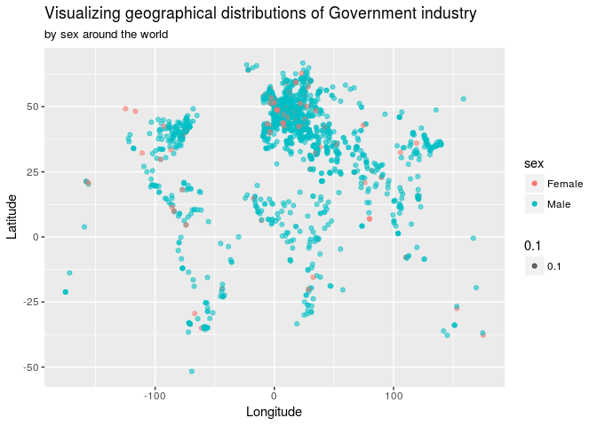
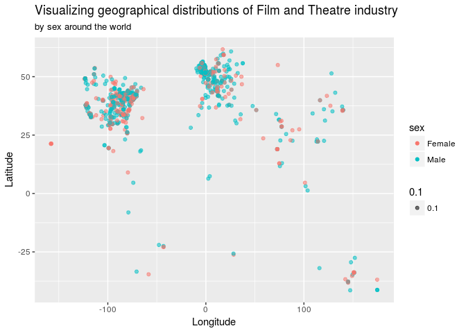

Wikipedia Popularity
================
Duke Squirrels
03/22/18

Section 1. Introduction
-----------------------

### Question

What makes a person on Wikipedia popular?

### Data

The data that we obtained contains information regarding famous figures throughout history. The data came from <https://www.kaggle.com/mit/pantheon-project/data> which originated from The Massachusetts Institute of Technology, about a year ago. The data is based off of metrics from many wikipedia pages. We felt that this data is credible given that it was processed and compiled from an institution as reputable as MIT. The variables within the data are as follows: `full_name`, `sex`, `birth_year`, `city`, `state`, `country`, `continent`, `latitude`, `longitude`, `occupation`, `industry`, `domain`, `article_languages`, `page_views`, `average_views`, and `historical_popularity_index`.

For our question, we will be focusing on these particular variables: `full_name`, `birth_year`, `latitude`, `longitude`, `occupation`, `sex`, and `industry`.

Section 2. Data analysis plan
-----------------------------

### Linear Modelling

We will use linear modelling with multiple variables to predict the popularity metrics. The explanatory variables could be sex, birth\_year, city, country, article languages, and occuption. We will do backwards selection to reach a model that will maximally explain numeric metrics like page views, and historical popularity index. We can also segment this across several time periods since something that was popular in a certain time period would likely have different things about it that made readers want to learn about it. For example, what made Roman period might be occupations or industries relating to war and politics. We can also segment by geographical region so we can understand what made things popular in certain regions because the factors would likely be different. For example, the maths and sciences were huge in the middle east in the middle ages and it would be interesting to quantify this.

### Mapping

The outcomes we are expecting are proportions of men and women in the top 5 industries across time. The explanatory variables in this scenario are `sex`, while the response is the proportion in the industries.

We will be using `sex` and `industry` to compare groups of historical figures across time.

Add preliminary exploratory data analysis here:

    ## # A tibble: 2 x 4
    ##   industry   sex        n   prop
    ##   <chr>      <chr>  <int>  <dbl>
    ## 1 Government Female   178 0.0658
    ## 2 Government Male    2527 0.934

This visualization of the \#1 industry (Government) and the resulting summary statistics help us gauge how women in Government have been represented throughout time and what it means in terms of their "popularity" on Wikipedia sites. We will create other visualizations like this one to show how representation of both men and women has changed over time in each industry. Though we have yet to incorporate an aspect of time into our visualization, we plan on recoding the variables to recount certain periods of time in chunks. For example, the "oldest" figures date back to 3500 BC, represented in the data as -3500. We will make the first chunk of time from -3500 to 0, which cuts down our observed historical figures to ~300. We will likely make the next chunks of time in the same amount of ~300 figures until we reach the present.

    ## # A tibble: 2 x 4
    ##   industry         sex        n  prop
    ##   <chr>            <chr>  <int> <dbl>
    ## 1 Film And Theatre Female   504 0.367
    ## 2 Film And Theatre Male     870 0.633

Unlike the previous visualization with the Government industry, where women were only 6.6% of the total Wikipedia sites that were designated in the Government industry, there are significantly more women in the Film and Theatre category, though male historical figures still dominate the industry. We will create other visuals and calculate the proportions for the rest of the top 5 industries and will choose several other variables to conduct statistical analyses on in order to determine what makes a historical figure popular on a Wikipedia site.

The statistical method that we believe will be useful includes finding the proportions of each industry grouped by sex. We can also use simulation techniques to estimate the difference in the number of page views when comparing one `domain` to another. We will also use statistical summaries like mean and median to say, for example, what the mean historical popularity index is for the historical figures from China.

### Hypothesis Testing

Finally, we can use hypothesis testing to validate our results on what makes someone/industry/occupation popular. We can ask questions like: is the popularity index for women lower than that of men? Does America have the most popular filmmakers? Was war more prevalent in the past or present?

Section 3. Data
---------------

    ## Observations: 11,341
    ## Variables: 17
    ## $ article_id                  <int> 308, 22954, 1095706, 25664190, 783...
    ## $ full_name                   <chr> "Aristotle", "Plato", "Jesus Chris...
    ## $ sex                         <chr> "Male", "Male", "Male", "Male", "M...
    ## $ birth_year                  <int> -384, -427, -4, -469, -356, 1452, ...
    ## $ city                        <chr> "Stageira", "Athens", "Judea", "At...
    ## $ state                       <chr> NA, NA, NA, NA, NA, NA, NA, NA, NA...
    ## $ country                     <chr> "Greece", "Greece", "Israel", "Gre...
    ## $ continent                   <chr> "Europe", "Europe", "Asia", "Europ...
    ## $ latitude                    <dbl> 40.33333, 37.96667, 32.50000, 37.9...
    ## $ longitude                   <dbl> 23.50000, 23.71667, 34.90000, 23.7...
    ## $ occupation                  <chr> "Philosopher", "Philosopher", "Rel...
    ## $ industry                    <chr> "Philosophy", "Philosophy", "Relig...
    ## $ domain                      <chr> "Humanities", "Humanities", "Insti...
    ## $ article_languages           <int> 152, 142, 214, 137, 138, 174, 192,...
    ## $ page_views                  <int> 56355172, 46812003, 60299092, 4030...
    ## $ average_views               <int> 370758, 329662, 281771, 294213, 35...
    ## $ historical_popularity_index <dbl> 31.9938, 31.9888, 31.8981, 31.6521...
